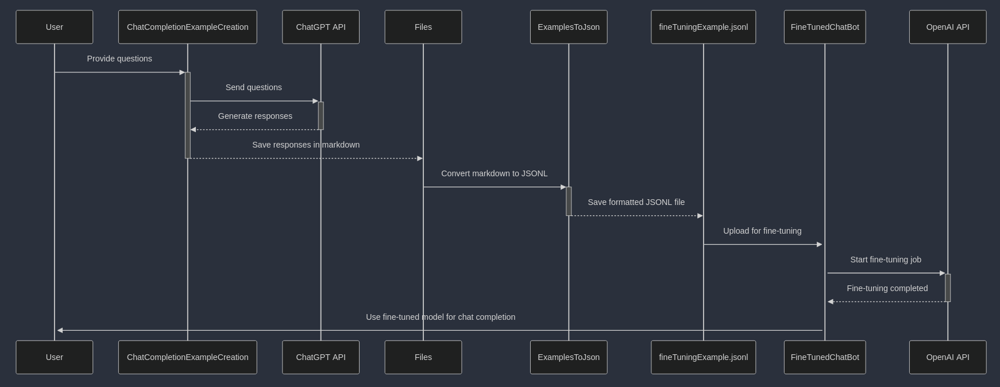

# Fine-Tuned ChatGPT Bot : Teacher for Computer Science

## Project Overview
This project aims to fine-tune a ChatGPT chatbot efficiently by automating the process of generating fine-tuning data. Instead of manually writing input-output pairs for fine-tuning, the project automates the creation of training data, formats it appropriately, and then fine-tunes the model.

## Workflow
1. **Generating Example Responses (ChatCompletionExampleCreation)**
   - This script processes user-provided questions using a predefined system prompt.
   - The questions are sent to the ChatGPT API for generating responses.
   - The responses are stored in markdown files inside the `files` directory.
   - Each file is named after its corresponding question.
   - Format of stored files:
     - First line: The question.
     - Second line: A separator `{seperator}`.
     - From the third line onwards: The ChatGPT response.
   - Previously processed questions are not processed again unless the last file is deleted.

2. **Converting Outputs to Fine-Tuning Format (ExamplesToJson)**
   - This script reads all markdown files in the `files` directory.
   - It separates each file's content into question and response using `split("\n{seperator}\n")`.
   - The extracted data is converted into the required JSONL format for fine-tuning.
   - The resulting file is saved as `fineTuningExample.jsonl`.

3. **Fine-Tuning and Using the Model (FineTunedChatBot)**
   - This script handles the actual fine-tuning process.
   - It uploads the `fineTuningExample.jsonl` file.
   - It starts and monitors the fine-tuning job until completion.
   - Once fine-tuning is done, it runs a chat completion using the fine-tuned model with streaming.

## File Structure
```
FineTunedTeacher/
│── ChatCompletionExampleCreation/
│   ├── .env                    # API key for OpenAI access
│   ├── app.js                  # Generates responses for training data
│   ├── prompt.md                # System prompt for response format
│
│── ExamplesToJson/
│   ├── app.js                   # Converts markdown files into JSONL format
│
│── FineTunedChatBot/
│   ├── .env                     # API key for OpenAI access
│   ├── app.js                   # Handles fine-tuning, monitoring, and chat completion
│
│── files/                        # Stores generated markdown response files
│   ├── outputExample.md          # Example processed question and response
│
│── fineTuningExample.jsonl       # The final fine-tuning file in JSONL format
│── questions.txt                 # List of questions to process   
│── systemPrompt.txt              # System role definition for fine-tuning JSON and the fine tuned chat bot


```

## Workflow Diagram



## Usage Instructions
All programs can be started by navigating to the respective folder and running:
```sh
npm install
npm start
```
You need to create a **.env** file in both ChatCompletionExampleCreation and FineTunedChatBot directories containing:

```
OPENAI_API_KEY="yourApiKey"
```

## Notes
- Ensure API credentials are correctly configured for all scripts.
- The separator `{seperator}` is critical in correctly parsing markdown files.
- Delete the last processed file if you want to regenerate responses for already processed questions.


This automation streamlines the process of generating, formatting, and fine-tuning ChatGPT models for better chatbot performance. 
